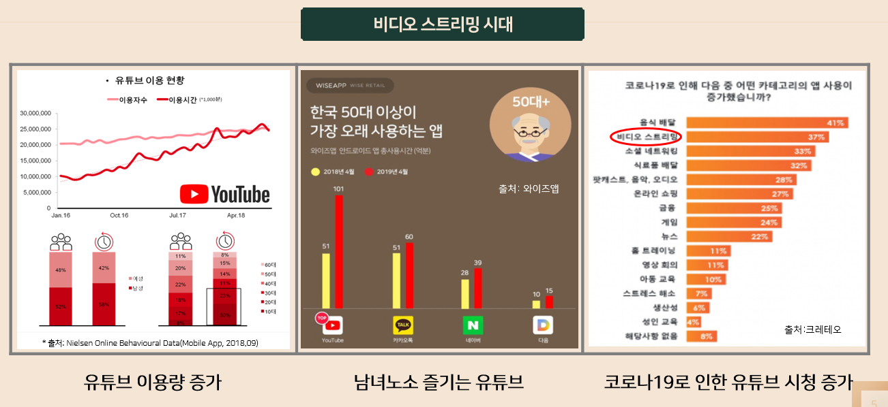
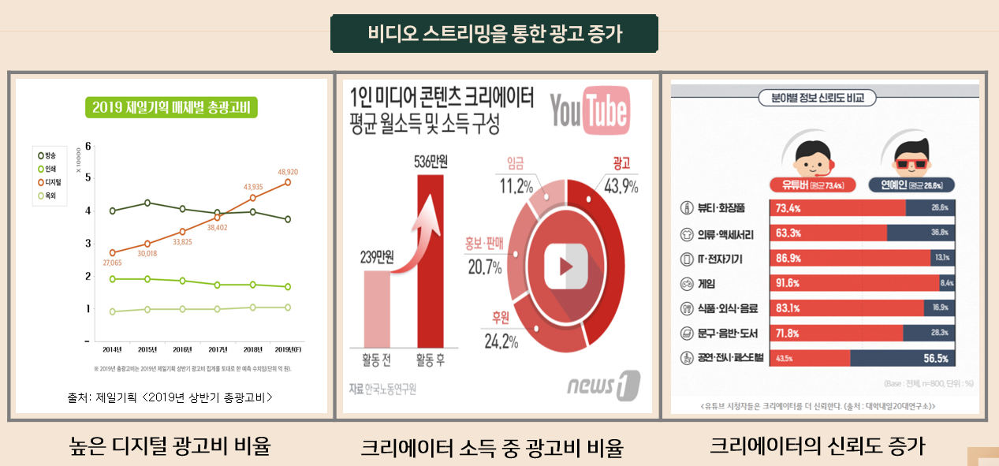
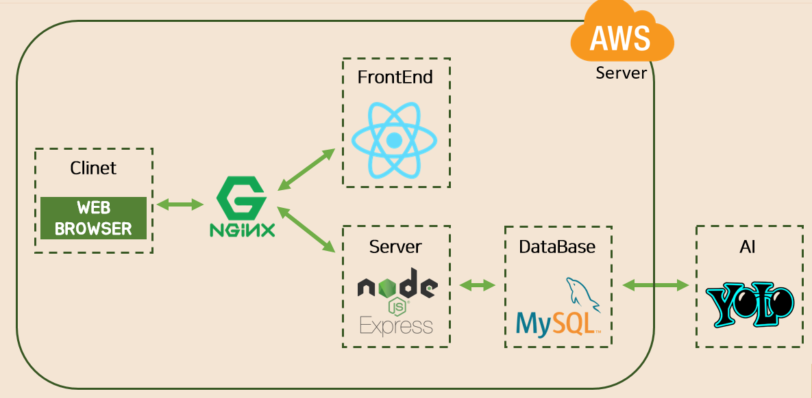
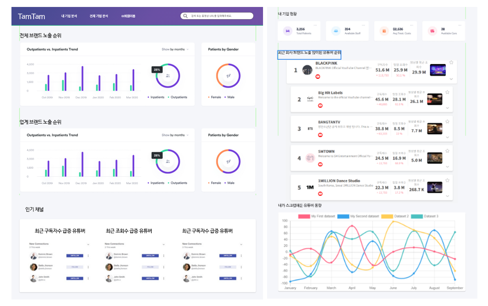
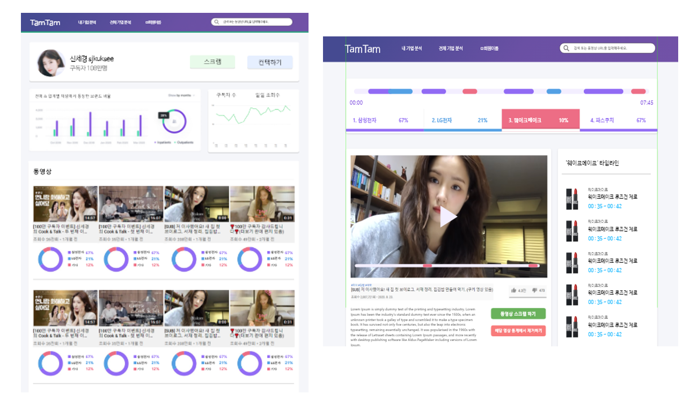
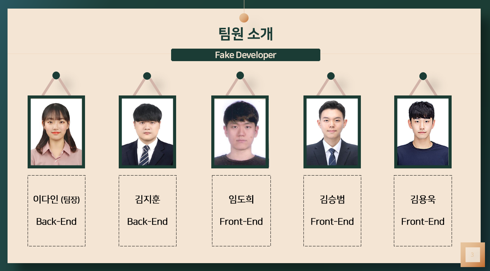

# TamTamLens

## 1. TamTamLens란 ?

```
비디오 스트리밍에 등장하는 브랜드 노출을 인식하여 기업에게 데이터를 제공해주는 B2B 서비스 
```


## 2. 추진 배경

#### 1) 비디오 스트리밍 시대




### 2) 비디오 스트리밍을 통한 광고 증가




## 3. Architecture 

​	                  


## 4. 와이어프레임

### 1) 메인 페이지



### 2) 유튜버 채널 페이지 / 동영상 재생 페이지




### 3) 기업 페이지 / 검색 결과 페이지


## 5. 팀원 소개

