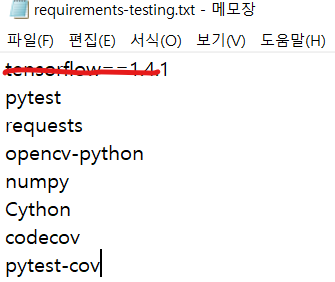
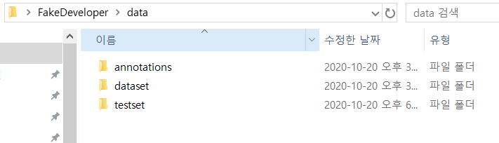
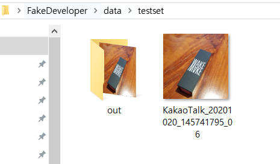
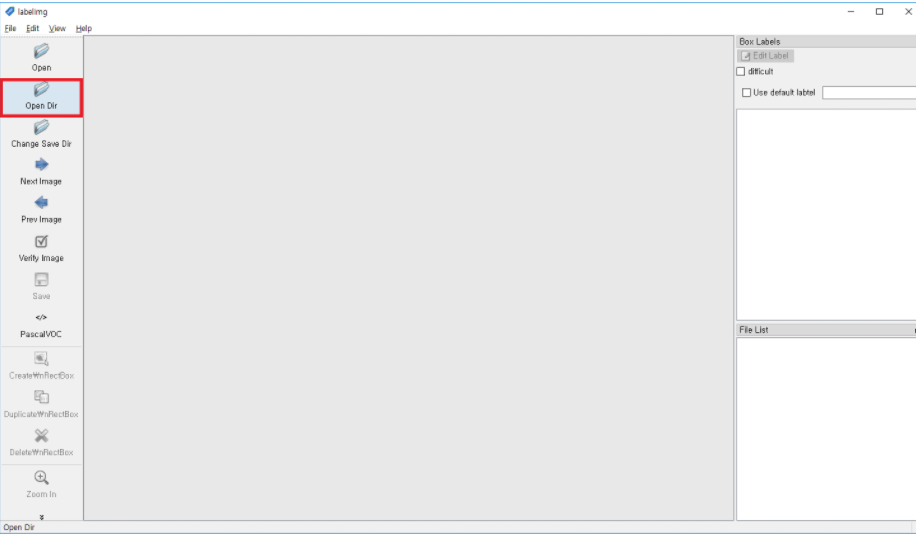
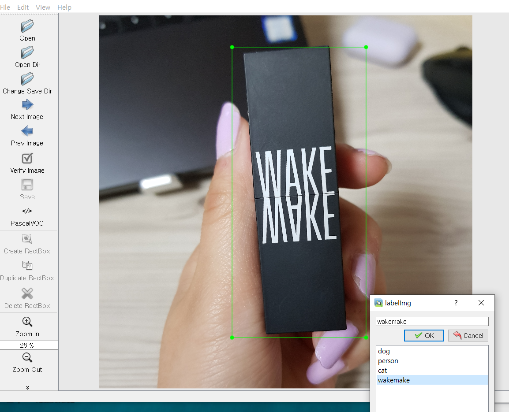
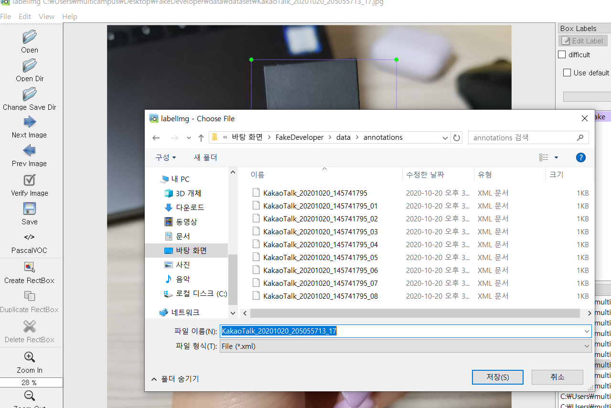
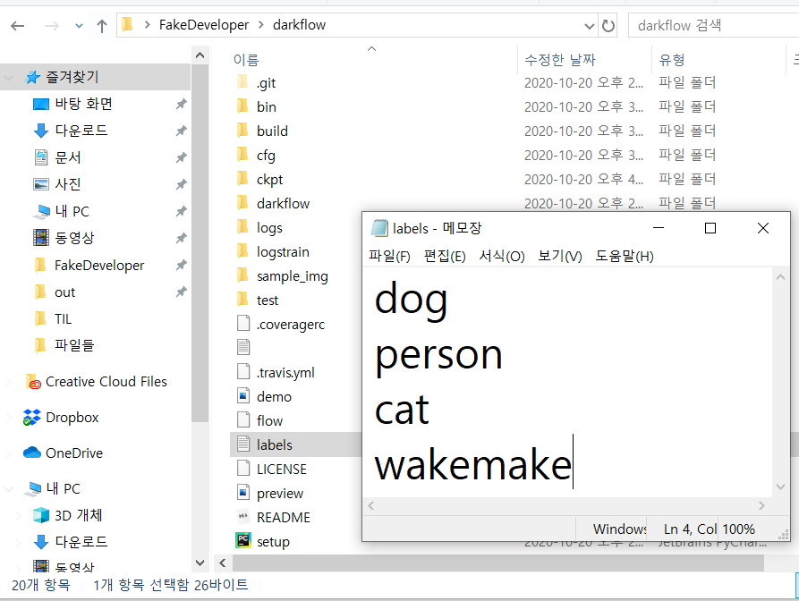
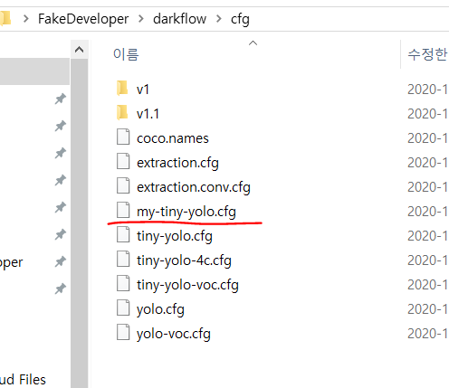
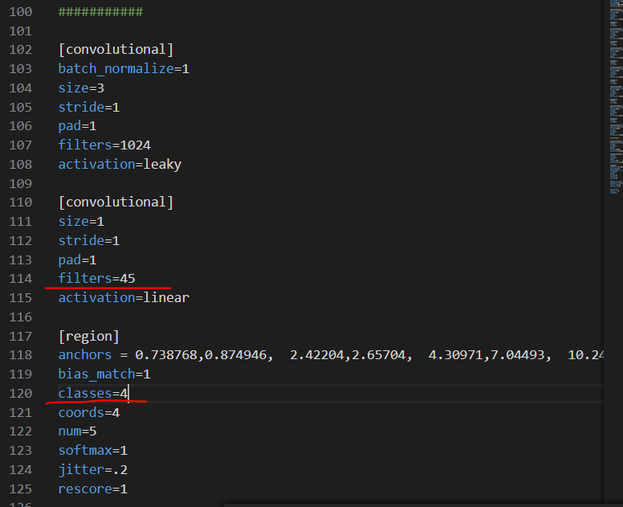

## 1. Image boundary-box labeling

- YOLO모델을 supervised learning에 속한다. 따라서, 가중치 학습을 위해 각각의 학습 이미지에 desired output 즉, 정답을 할당해주어야 한다. Object Detection 문제의 경우 정답 레이블은 각 객체의 class label과 boundary-box의 쌍들로 구성되며 이를 Annotation이라 부른다. 이미지에 Annotation을 할당하기 용이하도록 돕는 다양한 도구들이 존재한다. 여기서는 labelImg라는 Python 및 Pyqt 기반의 프로그램을 사용한다.

> labelImg : 이미지 labeling을 위한 도구

> https://github.com/tzutalin/labelImg 
>
> https://junyoung-jamong.github.io/deep/learning/2019/01/22/Darkflow%EB%A5%BC-%ED%99%9C%EC%9A%A9%ED%95%B4-YOLO%EB%AA%A8%EB%8D%B8-%EC%9D%B4%EB%AF%B8%EC%A7%80-%EB%94%94%ED%85%8D%EC%85%98-%EA%B5%AC%ED%98%84-in-windows.html 


## 2. Ananconda, labelImg 설치

- https://www.anaconda.com/products/individual#download

- https://github.com/tzutalin/labelImg

  - 시작할 폴더에 가서 위의 git clone 받기

- Open the Anaconda Prompt and go to the [labelImg](https://github.com/tzutalin/labelImg#labelimg) directory

  ```cmd
  cd Desktop
  cd (git clone 받아놓은 파일 명)
  cd labelImg
  
  conda install pyqt=5
  conda install -c anaconda lxml
  pyrcc5 -o libs/resources.py resources.qrc
  python labelImg.py
  ```

- 

  - python labelImg.py 하면 이런 창 뜨는데 일단은 닫고, 다른거 설치하자 


## 3. Tensoflow, Visual Studio, darkflow 설치

#### 1) anaconda에 Tensorflow 설치

```cmd
conda create -n tensorflow python=3.7 # 가상 환경 생성
activate tensorflow # 가상 환경 활성화
(tensorflow) > pip install tensorflow==1.15.0 # 1버전으로 

# 가상환경 종료는 종료할때만 입력
(tensorflow) > conda deactivate # 가상 환경 종료 
```


#### 2) Visual Studio C++ 설치

- https://visualstudio.microsoft.com/ko/downloads/ 다운로드 


#### 3) darkflow 설치

- Python으로 구현된 YOLO 모델이 [darkflow](https://github.com/thtrieu/darkflow)이다. darkflow를 이용하면 직접 딥러닝 구조를 구현하지 않아도 모델을 학습할 수 있다.

  ```cmd
  # git을 이용하여 darkflow의 github repository를 받는다.
  git clone https://github.com/thtrieu/darkflow.git
  
  # darkflow 폴더로 이동한 후 setup.py를 빌드 해준다.
  cd darkflow
  python setup.py build_ext --inplace
  pip install .
  ```

- 잠깐! 필요한 라이브러리도 설치해봐요!

  > ```
  > cd test
  > 
  > ## 설치하기 전에 requiremetns-tesitng.txt 파일에 들어가서 teserflow를 지워줍니다.(버전 문제가 있어요!)
  > pip install -r requiremetns-testing.txt
  > ```
  >
  > 

## 4. labelImg를 이용한 이미지 학습

#### 1) 데이터 폴더 정리

- 


- dataset -> 내가 학습 시킬 사진 저장

- annotations -> boundary 정해서 저장한 것

- testset 

  - 학습한 내용으로 인식할 사진 넣고
  - 인식 결과는 out 폴더에 저장됩니다.

  


#### 2) Open, Open Dir 클릭해서 이미지 등록

```cmd
cd labelImg

## 필요한 라이브러리 설치
cd requirements
pip install -r requirements-linux-python3.txt

## 설치 후 다시 labeImg 폴더로 나와줍니다.

cd ..
python labelImg.py
```




#### 3) Bounding-box를 지정

- w 누르고, 마우스로 bounding-box 잡아주기




#### 4) Save 누르고 annotations에 저장




#### 5) Training

- darkflow 폴더 내의 labels.txt 문서를 labelImg에서 처럼 자신의 클래스 목록으로 수정




- darkflow/cfg 폴더 내의 cfg 중 사용할 모델의 cfg를 자신의 문제에 맞춰 수정해줘야 하는데, 원본을 훼손하지 않기 위해 복사한 후에 수정

- tiny-yolo.cfg 파일을 복사해서 my-tiny-yolo.cfg로 파일명 수정

  

- 수정해야 할 내용은 filters 와 classes 값으로 우선,  classes는 정의한 문제의 클래스 수를 지정

- filters는 (5+classes)*5로 설정 (https://www.youtube.com/watch?v=9s_FpMpdYW8 참고)

  


#### 6) 학습해볼까요?

- 처음 가중치를 학습 할 경우:

```cmd
cd darkflow #darkflow dir로 이동 

python flow --model ./cfg/my-tiny-yolo.cfg --labels ./labels.txt --trainer adam --dataset ../data/dataset/ --annotation ../data/annotations/ --train --summary ./logs --batch 5 --epoch 100 --save 50 --keep 5 --lr 1e-04 --gpu 0.5
```

>- `trainer` : optimizer 설정
>
>- `lr` : learning rate로 1e-04는 0.0001을 의미한다.
>
>- ` gpu` : gpu 사용 여부, gpu가 없는 환경이라면 옵션을 제외하면 된다.
>
>- `load` : 이전 학습 가중치를 이어서 학습하겠다는 옵션으로 -1은 마지막 save를 불러온다. 특정 step부터 시작할 경우 저장된 step의 값을 명시적으로 입력하면 된다.
>
>- `epoch` : 한 번의 epoch는 인공 신경망에서 전체 데이터 셋에 대해 forward pass/backward pass 과정을 거친 것을 말함. 즉, 전체 데이터 셋에 대해 한 번 학습을 완료한 상태
>  - **epochs = 40이라면 전체 데이터를 40번 사용해서 학습을 거치는 것입니다.**
>
>- `batch`: **Batch Size**는 말 그대로 하나의 Mini-Batch를 몇개의 데이터로 구성할지에 대한 정보입니다. 100개의 이미지-라벨이 있는 상황에서 Batch Size를 5로 정했다면 우리의 모델은 한번에 하나의 데이터를 볼때마다 매번 가중치 값을 갱신하지 않고 5개 데이터에 대한 값을 한번에 계산한 뒤 가중치를 갱신해주게 되므로 총 20번의 갱신 과정만을 거치게 됩니다. 이 특성으로 인해 Mini-Batch Gradient Descent는 Naive한 Batch Gradient Descent보다 더 적은 컴퓨터 자원을 소모하게 됩니다.
>- `iteration` : **Iteration**은 한 Epoch를 진행하기 위해 몇 번의 가중치 갱신이 이루어지는지에 대한 정보입니다. 위의 예시에서는 가중치를 갱신하는 과정이 총 20번 이루어지므로 20이 Iteration의 값이라고 말할 수 있습니다. Batch Size가 커질수록 당연히 Iteration의 값은 줄어들고 Batch Size가 작아질수록 Iteration의 값은 늘어납니다. Batch Size 또한 프로그래머가 직접 조정해주어야 하는 Hyper Parameter의 일종으로 볼 수 있으므로 실험을 통해 최적값을 찾는 과정이 필요합니다.s

  

  - 이 전에 학습된 가중치를 이어서 학습할 경우:

  ```cmd
python flow --model ./cfg/my-tiny-yolo.cfg --labels ./labels.txt --trainer adam --dataset ../data/dataset/ --annotation ../data/annotations/ --train --summary ./logs --batch 5 --epoch 100 --save 50 --keep 5 --lr 1e-04 --gpu 0.5 --load -1
  ```

  

  

  #### 7) 학습 후

  ```cmd
python flow --imgdir ../data/testset/ --model ./cfg/my-tiny-yolo.cfg --load -1 --batch 1 --threshold 0.5
  ```

  - –threshold 0.5 는 confidence가 0.5보다 높을 경우에는 boundary-box를 수용하겠다는 의미이다. 다시 말해, 특정 부분에 객체가 존재할 확률이 0.5 이상이라고 예측할 경우에만 박스를 그린다.

  

  - 학습이 잘 되면 out 사진에서 이렇게 박스가 그려진다고 합니다
  - 모두들 화이팅 ! !! ! ! ! (지훈이가) ?? 


#### 8) 동영상 분석

```cmd
python flow --model cfg/my-tiny-yolo.cfg --load -1 --demo video2.mp4 --saveVideo --batch 1 --threshold 0.1
```

- video2는 darkflow 파일 안에 있어야 한다